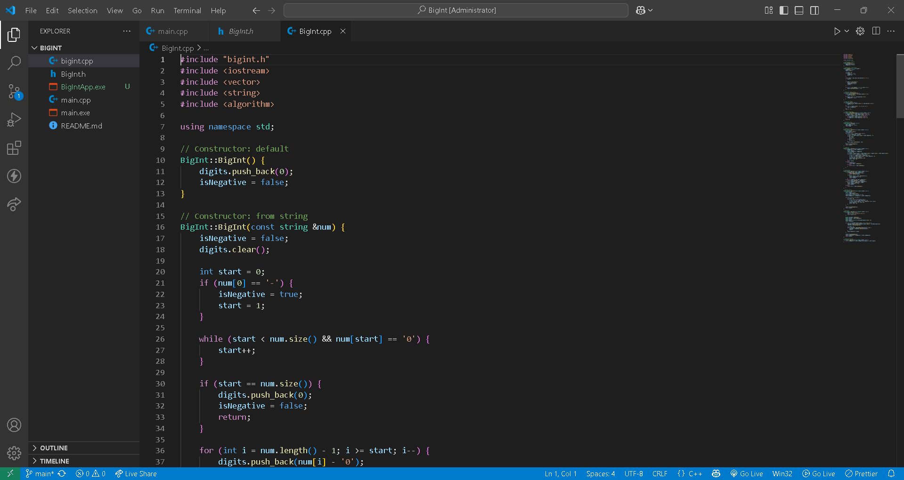
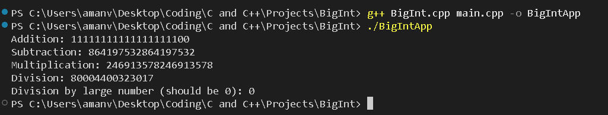

# BigIntProject

## 📌 Overview
This project implements a **Big Integer arithmetic library in C++**. It supports operations such as **addition, subtraction, multiplication, and division** on arbitrarily large integers that exceed built-in data type limits.

---

## 🚀 Features

- ➕ Addition, ➖ Subtraction, ✖️ Multiplication, ➗ Division of large integers  
- 📥 Input and 📤 Output support for big integers  
- ⚡ Efficient algorithms for large number calculations  

---

## 🛠️ How to Use

1. **Compile the source files** using a C++ compiler:
   ```bash
   g++ BigInt.cpp main.cpp -o BigIntApp
   ./BigIntApp
   ```
Run the executable and input large integers to perform operations interactively.

📸 Screenshots



📁 Make sure your screenshots are saved in a folder named screenshots/ inside the project directory.

👤 Author
Aman Verma
📧 amanv2225@gmail.com

